# Q&A Generator Angular App

An Angular application that displays question/answer pairs generated by the Flask API, along with topics and tools information.

## Features

- **Top Layer**: Displays current question and answer in read-only text boxes
- **Middle Layer**: Shows all available topics used for question generation
- **Bottom Layer**: Lists tools used in the current generation
- **Run Button**: Generates a new Q&A pair with a single click

## Prerequisites

- Node.js (version 18 or later) - [Download here](https://nodejs.org/)
- npm (comes with Node.js)
- Angular CLI (will be installed automatically by setup scripts)
- Flask API running on `http://localhost:5000`

## Package Information

This Angular application uses:
- **Angular 18+** - Latest version with standalone components
- **Modern HTTP Client** - Uses `provideHttpClient()` with fetch API
- **TypeScript 5.4+** - Latest TypeScript features
- **Standalone Bootstrap** - No need for NgModule, uses direct component bootstrap

## Features Included

- ✅ **Standalone Components** - Modern Angular architecture
- ✅ **HTTP Client with Fetch** - Improved performance and modern API
- ✅ **Animations Support** - Smooth UI transitions
- ✅ **Production Build Ready** - Optimized build configuration
- ✅ **Development Server** - Auto-reload and hot module replacement

## Setup Instructions

### Quick Installation (Recommended)

**Windows:**
```bash
# Run the installation script
.\install-packages.bat
```

**Linux/macOS:**
```bash
# Make script executable and run
chmod +x install-packages.sh
./install-packages.sh
```

### Manual Installation

1. **Navigate to the angular-app directory**:
   ```bash
   cd angular-app
   ```

2. **Install Angular CLI globally** (if not already installed):
   ```bash
   npm install -g @angular/cli
   ```

3. **Install dependencies**:
   ```bash
   npm install
   ```
   
   If you encounter peer dependency issues:
   ```bash
   npm install --legacy-peer-deps
   ```

3. **Start the Flask API** (in another terminal):
   ```bash
   # From the main project directory
   python app.py
   ```

4. **Start the Angular development server**:
   ```bash
   ng serve
   ```

5. **Open your browser** and navigate to:
   ```
   http://localhost:4200
   ```

## API Endpoints Used

The Angular app communicates with these Flask endpoints:

- `GET /run_new_caller/1` - Generates 1 Q&A pair
- `GET /run_new_caller/topics_list` - Gets list of topics
- `GET /run_new_caller/tool_list` - Gets list of available tools

## Application Structure

```
angular-app/
├── src/
│   ├── app/
│   │   ├── app.component.ts       # Main component logic
│   │   ├── app.component.html     # Main template
│   │   ├── app.component.css      # Component styles
│   │   └── api.service.ts         # API communication service
│   ├── index.html                 # Main HTML file
│   ├── main.ts                    # Application entry point
│   └── styles.css                 # Global styles
├── angular.json                   # Angular configuration
├── package.json                   # Dependencies and scripts
└── tsconfig.json                  # TypeScript configuration
```

## Usage

1. The application automatically loads on startup and generates an initial Q&A pair
2. Click the "Run" button to generate a new Q&A pair
3. View the available topics in the middle section
4. See which tools were used for the current generation in the bottom section
5. Browse all available tools in the reference section at the bottom

## CORS Configuration

If you encounter CORS issues, you may need to update your Flask app to include CORS headers:

```python
from flask_cors import CORS

app = Flask(__name__)
CORS(app)  # Allow all origins for development
```

## Build for Production

To build the application for production:

```bash
ng build --prod
```

The built files will be in the `dist/qa-generator-app/` directory.

## Troubleshooting

### Common Installation Issues

**1. Node.js Version Issues**
```bash
# Check Node.js version (should be 18+)
node --version

# If outdated, download latest LTS from https://nodejs.org/
```

**2. npm Permission Issues (macOS/Linux)**
```bash
# Fix npm permissions
sudo chown -R $(whoami) ~/.npm
```

**3. Angular CLI Installation Issues**
```bash
# Clear npm cache and reinstall CLI
npm cache clean --force
npm uninstall -g @angular/cli
npm install -g @angular/cli@latest
```

**4. Package Installation Failures**
```bash
# Clear everything and reinstall
rm -rf node_modules package-lock.json
npm install --legacy-peer-deps
```

**5. CORS Issues**
Make sure your Flask app includes CORS headers:
```python
from flask_cors import CORS
app = Flask(__name__)
CORS(app)
```

**6. Port Conflicts**
If port 4200 is in use:
```bash
ng serve --port 4201
```

### Getting Help

If you continue to have issues:
1. Check that Node.js version is 18 or later
2. Ensure Flask API is running on port 5000
3. Try running the installation scripts with administrator/sudo privileges
4. Check the browser console for JavaScript errors when the app loads

# Chat Tools Function Call Diagram

This diagram shows the function call structure and relationships in `chat_tools.py`, including entry points, core classes, tools, and utility functions.

```mermaid
---
title: Chat Tools Function Call Diagram
---
flowchart TD
    %% Entry Points
    A["`**Main Entry Points**`"] --> B[chat_with_agent]
    A --> C[get_simple_response]
    A --> D[get_tool_summaries]
    A --> E[get_available_tools]
    A --> F[get_agent]

    %% Core Agent Instance
    F --> G["`**FinancialChatAgent**
    _Core Agent Class_`"]
    B --> G
    C --> G
    D --> G
    E --> G

    %% Agent Methods
    G --> H[__init__]
    G --> I[chat]
    G --> J[_classify_user_query]
    G --> K[_setup_llm]
    G --> L[_setup_tools]
    G --> M[_create_agent]
    G --> N[_create_executor]
    G --> O[_extract_tool_info]
    G --> P[_get_tool_description]
    G --> Q[_fallback_response]
    G --> R[get_available_tools]
    G --> S[reset_conversation]

    %% Tool Setup calls Tool Classes
    L --> T["`**Tool Classes**
    _BaseTool Implementations_`"]
    T --> T1[BalanceTool]
    T --> T2[PaymentIncreaseTool]
    T --> T3[LumpSumTool]
    T --> T4[InterestRateTool]
    T --> T5[MissedPaymentTool]
    T --> T6[PreApprovalTool]
    T --> T7[ApplicationTool]
    T --> T8[RefinancingTool]
    T --> T9[HardshipTool]
    T --> T10[InsuranceTool]

    %% Tool Methods (showing pattern for one tool)
    T1 --> T1a[_run]
    T1 --> T1b[_arun]
    T2 --> T2a[_run]
    T2 --> T2b[_arun]
    T3 --> T3a[_run]
    T4 --> T4a[_run]
    T5 --> T5a[_run]
    T6 --> T6a[_run]
    T7 --> T7a[_run]
    T8 --> T8a[_run]
    T9 --> T9a[_run]
    T10 --> T10a[_run]

    %% Utility Functions
    U["`**Utility Functions**`"] --> U1[load_dotenv]
    U --> U2[extract_sin_number]
    U --> U3[generate_random_sin]
    U --> U4[get_topic_summary]
    U --> U5[get_all_summaries]

    %% Tool execution uses utilities
    T1a --> U2
    T1a --> U3
    T2a --> U2
    T2a --> U3
    T3a --> U2
    T4a --> U2
    T5a --> U2
    T6a --> U2
    T7a --> U2
    T8a --> U2
    T9a --> U2
    T10a --> U2

    %% Topic Functions (Standalone Functions)
    V["`**Topic Functions**
    _17 Financial Topic Handlers_`"] --> V1[balance]
    V --> V2[payment_increase]
    V --> V3[lump_sum]
    V --> V4[interest_rate]
    V --> V5[missed_payments]
    V --> V6[pre_approval]
    V --> V7[next_steps]
    V --> V8[loan_application]
    V --> V9[rate_types]
    V --> V10[amortization]
    V --> V11[term_renewal]
    V --> V12[prepayment_penalties]
    V --> V13[prepayment_options]
    V --> V14[refinancing]
    V --> V15[financial_hardship]
    V --> V16[insurance]
    V --> V17[application]

    %% Additional Utility Topic Functions
    W["`**Shared Utility Functions**`"] --> W1[payment_info]
    W --> W2[documents]
    W --> W3[timelines]
    W --> W4[calculation]
    W --> W5[options]
    W --> W6[rate_variation]

    %% Topic mapping
    X[TOPIC_FUNCTIONS] --> V
    U4 --> X
    U5 --> X

    %% Agent Classification Logic
    J --> Y["`**Classification Logic**
    _Keyword Matching_`"]
    Y --> Y1[tool_mappings array]
    Y --> Y2[Keyword matching loops]
    Y --> Y3[Priority-based selection]

    %% Data Flow Dependencies 
    I --> J
    I --> L
    J --> Y
    Y --> Z[Selected Tool Execution]
    Z --> T

    %% External Dependencies
    EXT["`**External Dependencies**`"] --> EXT1[LangChain Components]
    EXT --> EXT2[Azure OpenAI]
    EXT --> EXT3[Pydantic Models]
    EXT --> EXT4[Environment Variables]
    
    K --> EXT2
    H --> EXT1
    H --> EXT3
    U1 --> EXT4

    %% Styling
    classDef entryPoint fill:#e1f5fe,stroke:#01579b,stroke-width:2px,color:#000000
    classDef coreClass fill:#f3e5f5,stroke:#4a148c,stroke-width:2px,color:#000000
    classDef toolClass fill:#e8f5e8,stroke:#1b5e20,stroke-width:2px,color:#000000
    classDef utilFunction fill:#fff3e0,stroke:#e65100,stroke-width:2px,color:#000000
    classDef topicFunction fill:#fce4ec,stroke:#880e4f,stroke-width:2px,color:#000000
    classDef external fill:#f1f8e9,stroke:#33691e,stroke-width:2px,color:#000000

    class A,B,C,D,E,F entryPoint
    class G,H,I,J,K,L,M,N,O,P,Q,R,S coreClass
    class T,T1,T2,T3,T4,T5,T6,T7,T8,T9,T10,T1a,T1b,T2a,T2b,T3a,T4a,T5a,T6a,T7a,T8a,T9a,T10a toolClass
    class U,U1,U2,U3,U4,U5,W,W1,W2,W3,W4,W5,W6 utilFunction
    class V,V1,V2,V3,V4,V5,V6,V7,V8,V9,V10,V11,V12,V13,V14,V15,V16,V17 topicFunction
    class EXT,EXT1,EXT2,EXT3,EXT4 external
```




## Key Function Call Relationships:

### 1. **Entry Points → Core Agent**
- `chat_with_agent()` → Creates/gets FinancialChatAgent instance
- `get_simple_response()` → Calls chat_with_agent() → Returns text only
- `get_available_tools()` → Gets agent → Returns tool list

### 2. **Agent Initialization Flow**
- `__init__()` → `_setup_llm()` → Azure OpenAI configuration
- `__init__()` → `_setup_tools()` → Creates all 10 tool instances  
- `__init__()` → `_create_agent()` → Builds LangChain agent
- `__init__()` → `_create_executor()` → Creates execution engine

### 3. **Chat Processing Flow**
- `chat()` → `_classify_user_query()` → Keyword matching logic
- `chat()` → Tool selection → Tool execution via `_run()`
- `chat()` → `_fallback_response()` → Backup response generation

### 4. **Tool Execution Pattern**
- Each tool class implements `_run()` and `_arun()` methods
- Tools use utility functions: `extract_sin_number()`, `generate_random_sin()`
- Tools return formatted responses with prefix codes (BALNC, PAYUP, etc.)

### 5. **Classification Algorithm**
- `_classify_user_query()` uses priority-ordered keyword matching
- `tool_mappings` array defines keywords → tool relationships
- More specific patterns checked first (pre-approval, hardship, etc.)
- Falls back to `general_inquiry` if no matches

### 6. **Topic Function Integration**
- 17 standalone topic functions handle specific financial scenarios
- `TOPIC_FUNCTIONS` dictionary maps topic numbers to functions
- `get_topic_summary()` and `get_all_summaries()` provide access
- Topic functions are independent of the agent system

### 7. **Utility Dependencies**
- `load_dotenv()` → Environment configuration
- `extract_sin_number()` → Extracts/validates SIN from queries  
- `generate_random_sin()` → Creates test SIN numbers
- Used across multiple tool implementations

This architecture provides a flexible, extensible system for financial chatbot functionality with clear separation of concerns between classification, tool execution, and response generation.