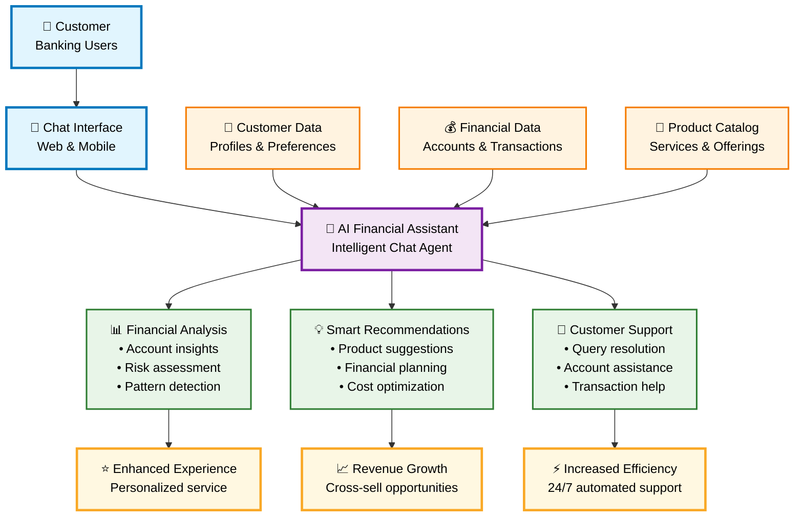

# Simplified Financial Chat Agent - Executive View

## Key Business Benefits

### 🎯 **Customer Experience**
- **24/7 Availability**: Instant responses to customer inquiries
- **Personalization**: Tailored recommendations based on customer data
- **Self-Service**: Reduces wait times and improves satisfaction

### 💰 **Revenue Impact**
- **Cross-Selling**: AI identifies product opportunities automatically
- **Retention**: Proactive financial guidance keeps customers engaged
- **Efficiency**: Reduces operational costs while improving service quality

### 📊 **Operational Excellence**
- **Scalability**: Handles unlimited concurrent conversations
- **Consistency**: Standardized responses and recommendations
- **Insights**: Rich analytics on customer behavior and preferences